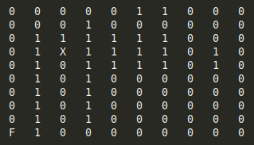
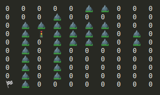
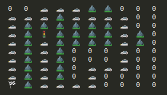

# Proyecto de Programación Orientado a Objetos

    <b>Nombre del equipo</b>

Integrantes - (Usuarios Github:):
--

1.- <b>nombre_completo1</b> 
    <i>usuario_github1</i>

2.- <b>nombre_completo2</b> 
    <i>usuario_github2</i>

3.- <b>nombre_completo3</b> 
    <i>usuario_github3</i>

Instrucciones:
--

Nombre del Proyecto:
--
El proyecto lleva como nombre: <b>Sistema Planeador de Rutas</b>

Objetivo
--
El objetivo del <b><i>Sistema Planeador de Rutas</i></b> es generar un Mapa 
Bidimensional de forma aleatoria y que cumpla con la condicion de no caer
en un callejon sin salida. Además, este debe encontrar la ruta optima entre
dos puntos ingresados por el usuario en el mapa generado.

Ejemplo
--

Dado el siguiente Mapa:

Donde:
* <b>X</b> es la posición inicial <b>{3,2}</b>
* <b>F</b> es la posición final <b>{9, 0}</b>
* <b>1</b>, indican los obstaculos y que no se puede pasar por esos puntos.
* <b>0</b>, indican las posiciones libres y que el vehiculo puede utilizar.

El mapa generado seriá el siguiente:

Donde:
* El semáforo indica el punto de partida
* La bandera indica el punto de llegada.
* El valor <b>1</b> representan las montañas

Mapa de la ruta generada por el vehiculo desde el punto
inicial al punto final.

Utilizar en la Implementación
--
Leer archivos, estructurar la data, Procesar, y luego
formatear la salida en el terminal.

Separar las definiciones de las implementaciones, utilizar 
diferentes clases que manejen diferents tipos de datos y 
diferentes tareas.

Crear clases que esten relacionadas por composición
y/o herencia.

Otras clases pueden ser mergeadas a travez de programacion generica.

En este proyecto demostraran sus habilidades en programación
orientado a objetos en C++.

Fecha de Asignacion:
--
Semana 7 - Jueves 03/10/2019

Número de Alumnos por equipo
--
*   3 alumnos por equipo
*   Uno de los integrantes del grupo ingresa al link de classroom y crea un proyecto
asignadole un nombre.
*   El resto de los integrantes del grupo busca ese nombre creado para
ser parte del grupo. 

Recursos
--
*   [Comandos GitHub](recursos/git-cheat-sheet-education.pdf)

Hito 1
--
Semana 11

Hito 2
--
Semana 15
